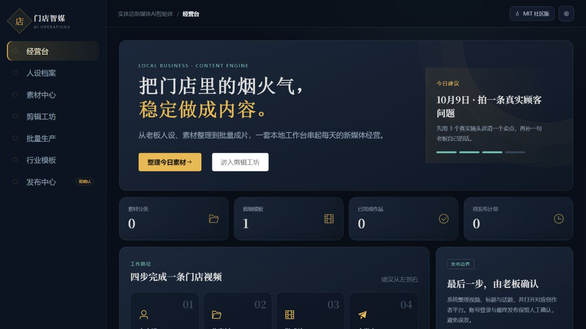
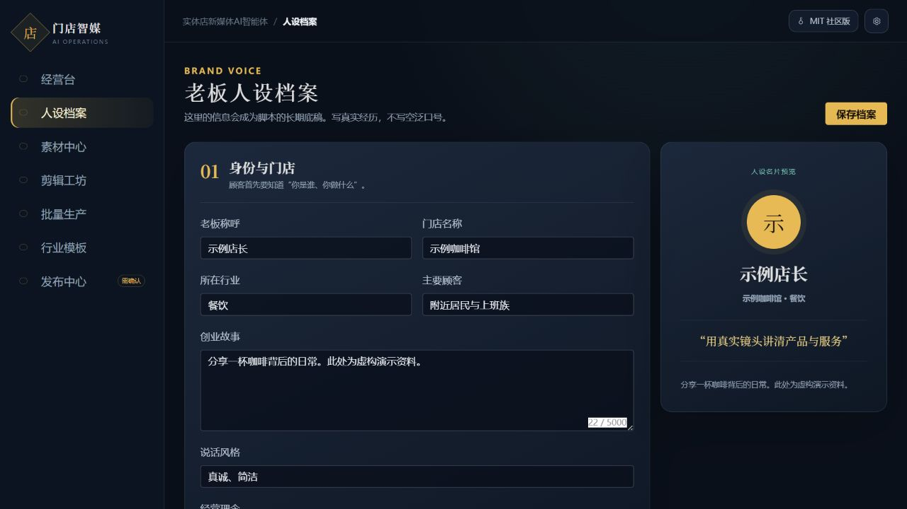
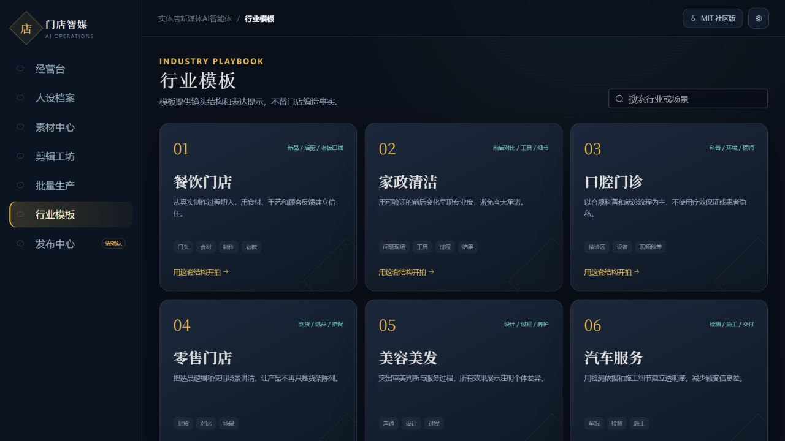
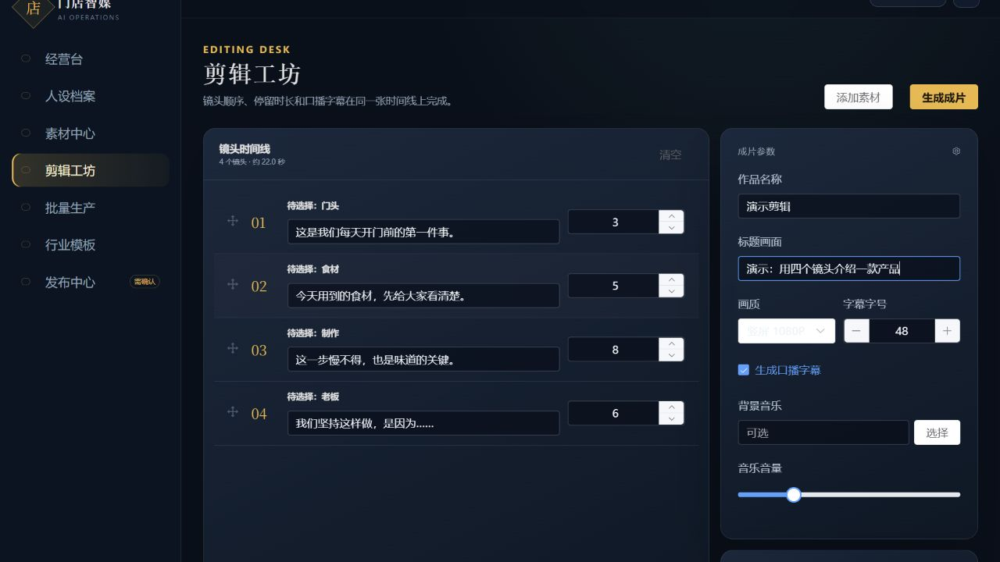

<div align="center">

<p><a href="./README.md"><kbd><b>English</b></kbd></a>&nbsp;&nbsp;<a href="./README.zh-CN.md"><kbd>简体中文</kbd></a></p>

# Storefront Media Agent

### Turn everyday store footage into a repeatable content workflow.

A local Windows video workbench for small businesses: define your brand voice, organize media, plan shots, compose vertical videos, run batches and prepare posts for human review.

[**Get the source bundle**](./storefront-media-agent-source.zip) · [**Get started**](#getting-started) · [**Explore the workflow**](#four-steps-from-a-store-story-to-a-prepared-post) · [**Contribute**](./CONTRIBUTING.md)

**MIT community edition · Electron + Vue + FastAPI · Real FFmpeg composition**



</div>

## A content routine built around your own business

A useful store video often starts with something ordinary: how a product is made, why an owner chose an ingredient, the detail behind a service, or a question customers ask every day.

Storefront Media Agent brings those pieces into one local workbench. Keep a reusable store profile, organize the footage you already own, select a shooting structure, arrange shots and subtitles, and turn a saved template into a repeatable production process.

This is a sanitized community edition based on the Windows 0.2.0 project. Commercial activation and machine tracking are removed. The independent local API-token protection, Electron sandbox/context isolation and secure-storage integration remain. The community app has its own application identity and data namespace.

## Four steps from a store story to a prepared post

| Step | Workbench | What you do |
|---|---|---|
| 01 | Brand persona | Describe the owner, store, audience, story and speaking style |
| 02 | Material center | Scan a directory you choose and organize photos/videos without moving the originals |
| 03 | Editing desk | Arrange shots, timing, captions, titles and background music; compose a vertical video |
| 04 | Publishing center | Prepare video, title and topics, then finish the post yourself on the official creator platform |

**Publishing is assisted, not unattended.** Platform login and the final publish action remain with the user. The app does not bundle platform passwords or cookies and does not claim automatic cross-platform posting.

## Explore the screens

### Keep the store's voice consistent

Store the owner persona and business context as a reusable foundation for your content. The preview below uses a fictional cafe, not a real customer profile.



### Start with a useful shooting structure

Built-in playbooks cover food service, home cleaning, dental clinics, retail, beauty/hair and automotive services. They offer shot structures and expression prompts; they do not invent your business facts or guarantee compliance or campaign performance.



### Bring the plan into the timeline

Choose a structure, then add your own footage. Adjust shot order, duration, subtitle text, title and music settings in one editing workspace. The screenshot shows an unfilled demonstration shot plan, not a finished customer video.



## Current capabilities

- **Local media organization:** scan selected directories, preview supported media and save categories. Original files remain where they are.
- **Vertical video composition:** FFmpeg handles real output, with 720p/1080p settings, titles, subtitles and optional background music.
- **Reusable editing templates:** save shot plans and composition options for another production cycle.
- **Batch production:** execute saved templates through an FFmpeg task queue and retain progress and failure details.
- **Optional AI scripts:** connect your own supported Bailian/DashScope account for script generation. The request is sent to the provider; charges and data policies apply. The Electron client uses safeStorage for saved keys.
- **Publishing preparation:** organize output, titles, topics and plans, with shortcuts to configured official creator platforms. Final submission is manual.

The current application UI is Chinese. The language buttons switch this introduction; they do not change the runtime UI language.

## Getting started

Prepare **Windows, Python 3.11, Node.js 22.12 or later, and FFmpeg/ffprobe on PATH**. Obtain video tools from the [official FFmpeg download page](https://ffmpeg.org/download.html). No runtime binaries or installer are bundled in this source repository.

Download and extract the [reviewed source ZIP](./storefront-media-agent-source.zip), or use the complete Git source tree when available. From the source root in PowerShell:

```powershell
python -m venv .venv
.venv/Scripts/python -m pip install -r src/backend/requirements-dev.txt
npm ci
npm ci --prefix src/frontend
npm run dev
```

The desktop shell starts the local backend, selects an available loopback port and passes a random local token to its renderer. Development without Electron is not a production network service.

### Run the source checks

```powershell
.venv/Scripts/python -m pytest -q
npm run build:renderer
node --check src/electron/main.js
```

The backend tests use isolated data. The real FFmpeg test generates two solid-color clips, combines them with a title/subtitles, and checks that the output has a playable 720×1280 video stream.

### Build a Windows installer

```powershell
.venv/Scripts/python scripts/build.py
```

The helper prepares the frontend and frozen backend and requires a local FFmpeg runtime with its license notice. If distributing an installer, review the license and matching source obligations for the actual runtime build; see [NOTICE](./NOTICE.md). This repository has not accepted a signed installer, upgrade path or live AI-provider session for the community release.

## Under the hood

| Component | Technology | Responsibility |
|---|---|---|
| Desktop shell | Electron | Window, native file dialogs, local service startup, secure settings and creator-site allowlist |
| Interface | Vue 3, Element Plus | Dashboard, persona, material center, timeline, batch queue and publishing preparation |
| Backend | FastAPI, aiosqlite | Local API, records, composition jobs and optional script requests |
| Media engine | FFmpeg, ffprobe | Media inspection, clip processing, subtitles and final composition |

## Common questions

<details><summary>Does the community edition need an activation code?</summary>

No. The public community edition reports MIT community status without a machine identifier or commercial key. The original commercial project is unchanged, and its private operator tools and keys are excluded.

</details>

<details><summary>Can I use it without an AI key?</summary>

Yes: explore the interface, use your own media, edit and compose videos, save templates and prepare publishing materials. Provider-backed script generation needs your own supported service configuration. No live AI key is shipped.

</details>

<details><summary>Will it automatically post to my accounts?</summary>

No. It prepares materials and opens configured creator platforms. You retain control of login and the final post. Automated platform posting is not implemented or accepted here.

</details>

<details><summary>Are the screenshots real customer results?</summary>

No. They show the community interface with fictional store data and a sample shot plan. Test footage contains solid colors. No customer photos, genuine campaigns or traffic-performance claims are published.

</details>

## Contribute one useful improvement

Useful directions include media-format compatibility, subtitle layout, timeline usability, batch failure recovery, accessibility and English UI localization. Provide a small reproducible example with fictional business data. Keep keys, platform credentials and customer media out of issues and pull requests.

If this workflow is useful to you, **star the repository**, report a concrete issue or improve one part of the production flow.

## Validation and source scope

Frontend installation/build, Python compilation and Electron syntax checks passed. **Eight backend tests passed**, including retained API-token protection and actual FFmpeg composition. This does not establish live AI quality, platform posting, installer acceptance or all-format/media compatibility. See [validation](docs/VALIDATION.md).

The public source excludes original Git history, databases, private media, logs, keys, dependency directories, runtime binaries and installers. Code and the generated icon use [MIT](./LICENSE); dependencies retain their own licenses. See [source scope](docs/OPEN_SOURCE_SCOPE.md), [media notice](docs/MEDIA_NOTICE.md), [NOTICE](./NOTICE.md) and [security guidance](./SECURITY.md).

<p align="center"><a href="./README.zh-CN.md"><kbd>切换到简体中文</kbd></a></p>
